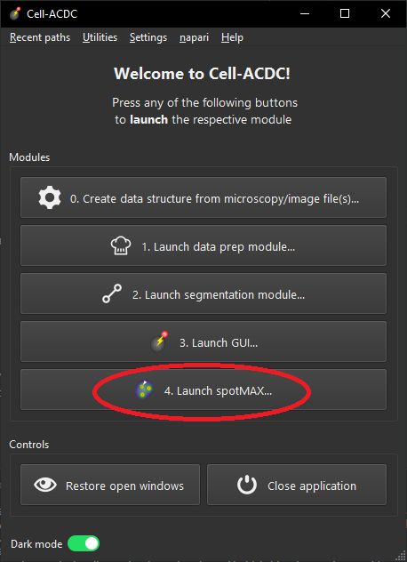
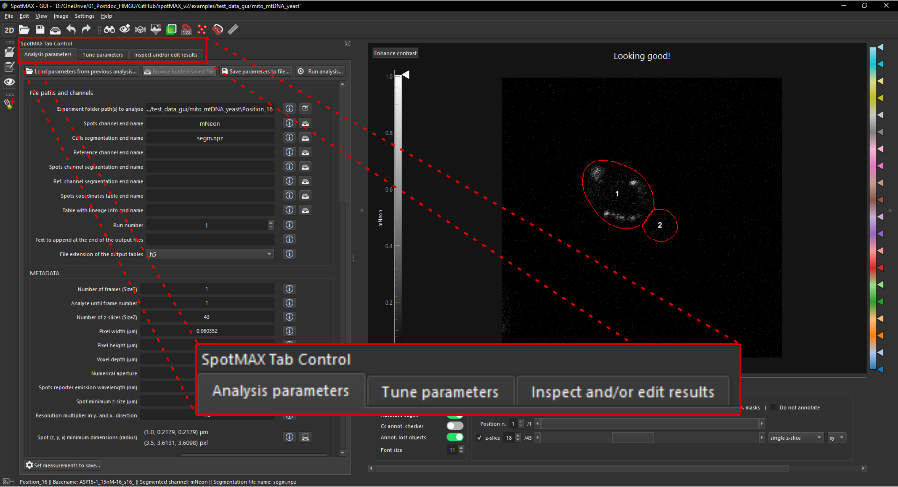

.. _Cell-ACDC: https://cell-acdc.readthedocs.io/en/latest/index.html

Configuring and running spotMAX from the GUI
============================================

SpotMAX GUI is based on the `Cell-ACDC`_ GUI and it can be launched from the 
Cell-ACDC launcher. If spotMAX and Cell-ACDC are correctly installed, run the 
command ``acdc`` to open the launcher. From the launcher, you can open spotMAX 
GUI by clicking on ``4. Launch spotMAX...`` button, as shown in the screenshot below.

When you open the GUI you will see on the left three tabs:

 
:ref:`analysis_parameters_tab`.
:ref:`tune_parameters_tab`.
:ref:`inspect_results_tab`.

