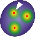

.. _GitHub: https://github.com/ElpadoCan/spotMAX

|spotmaxlogo| Welcome to SpotMAX!
=================================

Fluorescence microscopy data analysis in Python
-----------------------------------------------

|githublogo| Source code on `GitHub`_

Here you will find all you need to master our tool! 

If you need to **analyse fluorescence microscopy data** you are probably in the 
right place.

SpotMAX will help you with these **two tasks**:

1. Detect and quantify **globular-like structures** (a.k.a. "spots")
2. Segment and quantify **fluorescently labelled structures**

SpotMAX excels in particularly challenging situations, such as 
**low signal-to-noise ratio** and **high spot density**

It supports **2D, 3D, 4D, and 5D data**, i.e., z-stacks, timelapse, and multiple 
fluorescence channels (and combinations thereof).

Here some examples:

.. carousel::
   :show_captions_below:
   :show_controls:
   :show_indicators:

   .. figure:: images/home_carousel/spotmax_GUI.png

      Graphical User Interface

      Interactively set the analysis parameters
   
   .. figure:: images/home_carousel/C_elegans_halo.png

      Synaptonemal Complex in *C. elegans*

      Accurately detect touching spots
   
   .. figure:: images/home_carousel/Anika_mito_yeast.png

      Detect spots and segment a reference channel

      Segment and quantify the mitochondrial network in 3D
   
   .. figure:: images/home_carousel/Jette_stem_cells_telomeres.png

      Telomeres length quantification in stem cells (DNA-FISH)

      Quantify telomeres length as a function of cell size 
   
   .. figure:: images/home_carousel/Dimitra_smFISH.png

      Count single-molecule of mRNAs in smFISH data

      Optimised for high spot density
   
   .. figure:: images/home_carousel/inspect_results_GUI.png

      Inspect the results

      Annotate detected spots and inspect features by hovering on the spot

.. toctree::
   :maxdepth: 2

   install/index
   misc/get_started
   run/index
   how_it_works/index
   parameters/index
   features/index
   misc/output_files
   tutorials/index
   misc/contributing
   api/api
   misc/cite
   misc/logos