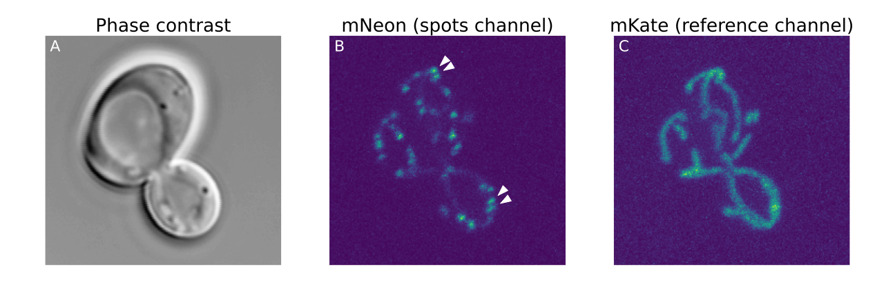

.. _Cell-ACDC: https://cell-acdc.readthedocs.io/en/latest/index.html
.. _GitHub: https://github.com/ElpadoCan/spotMAX/issues
.. _BioImage Model Zoo: https://bioimage.io/#/
.. _Quasar 670: https://www.aatbio.com/fluorescence-excitation-emission-spectrum-graph-viewer/quasar_670
.. _seel-2023: https://www.nature.com/articles/s41594-023-01091-8

.. _mtdna-yeast:

Count single mitochondrial DNA nucleoids and quantify mitochondrial network volume
==================================================================================

In this tutorial we will count the number of mitochondrial DNA nucleoids and we 
will segment the mitochondrial network in 3D as a reference channel. 

For details about the method used to visualize these structures see 
`this publication <seel-2023>`_. 

.. admonition:: Goals

    * Detect and separate highly connected spots
    * Segment network-like structures as reference channel (mitochondrial network)
    * Filter valid spots based on reference channel signal

.. include:: _preliminary_segment_cells.rst

Dataset
-------

To follow this tutorial, download the dataset from 
`here <https://hmgubox2.helmholtz-muenchen.de/index.php/s/AttDZajALPme4nz>`_.

This dataset was published in `this publication <seel-2023>`_. 

After unzipping the downloaded file, you will see the following folder structure::
    
    Position_26
    └── Images
        ├── ASY15-1_0nM-26_s26_acdc_output.csv
        ├── ASY15-1_0nM-26_s26_last_tracked_i.txt
        ├── ASY15-1_0nM-26_s26_metadata.csv
        ├── ASY15-1_0nM-26_s26_mKate.tif
        ├── ASY15-1_0nM-26_s26_mNeon.tif
        ├── ASY15-1_0nM-26_s26_phase_contr.tif
        ├── ASY15-1_0nM-26_s26_segm.npz
        └── ASY15-1_0nM-26_s26_segmInfo.npz

Some of these files are generated by `Cell-ACDC`_ and they will not be discussed here. 

What we can see is that we have 3 ``.tif`` files corresponding to 3 channels 
whose filename end with ``mKate.tif``, ``mNeon.tif``, ``phase_contr.tif``. 

The ``phase_contr`` channel is the channel we used to segment the single cells with 
`Cell-ACDC`_. The resulting segmentation masks are saved in the file ending with 
``segm.npz``. 

The ``mNeon`` channel is the channel where we want to detect the spots. 

The ``mKate`` channel is the labelling of the mitochondrial network and we can 
use it in spotMAX as the reference channel (more details below). 

    **A)** Phase contrast channel used for segmentation of the cells. 
    **B)** mNeon channel used to visualize the mitochondrial DNA nucleoids 
    (spots channel). Arrows indicate areas of connected spots. **C)** mKate 
    channel used to label the mitochondrial network (reference channel).

.. toctree:: 
    :hidden:

    _preliminary_segment_cells.rst
